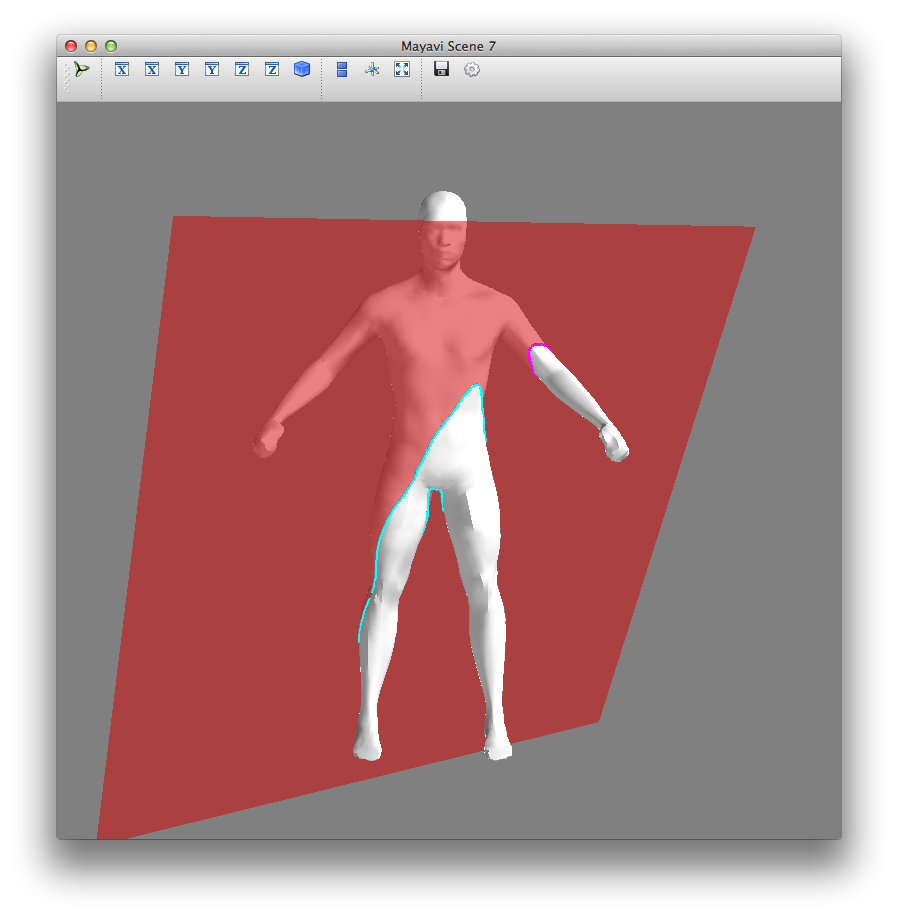

========================================================
meshcut - Python utilities to slice 3D triangular meshes
========================================================

.. image:: https://github.com/julienr/meshcut/actions/workflows/checks.yml/badge.svg?branch=master
   :target: https://github.com/julienr/meshcut/actions

A python library to compute the planar cross-section of a 3D mesh.

Given a 3D mesh and a cut plane, this computes a (set of) polyline(s) that
results from cutting the mesh with the plane.

Requires python and numpy. Mayavi is used for visualisation in the examples.

Usage
=====
Run the examples with ::

    python3 examples/0_cross_section.py

Given ::

    In [17]: verts
    Out[17]:
    array([[ 1.6315   , -0.1505   ,  0.       ],
           [ 1.6376   , -0.1516   ,  0.       ],
           [ 1.6493   , -0.1518   ,  0.       ],
           ...,
           [ 1.62088  , -0.0263264, -0.0716966],
           [ 1.63381  , -0.0500889,  0.0726852],
           [ 1.63381  , -0.0500889, -0.0726852]])

    In [20]: faces
    Out[20]:
    array([[1530, 1337, 1338],
           [4549, 4725, 4548],
           [2940, 2950, 3787],
           ...,
           [3107, 3438, 3439],
           [2263, 2281, 2262],
           [3116, 3119, 4171]])

    In [21]: meshcut.cross_section(verts, faces, plane_orig=(1.2, -0.125, 0),
       ....:                       plane_normal=(1, 0, 0))
    Out[21]:
    [array([[  1.20000000e+00,  -1.28957692e-01,  -1.02180769e-01],
            [  1.20000000e+00,  -1.37182869e-01,  -8.06541833e-02],
            [  1.20000000e+00,  -1.36863816e-01,  -6.95125000e-02],

Thanks
======
Thanks to @superzanti for the STL use case and the sphere model.

Authors
=======
Julien Rebetez
